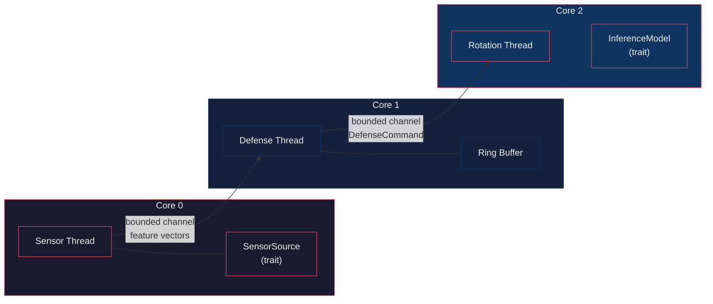

<div align="center">

# EDGE

**A budget-gated, continuous-rotation adversarial defense that protects TinyML classifiers by rotating the decision manifold in reaction to observed feature trajectories — verified end-to-end on ARM Cortex-A76 (Raspberry Pi 5) and Cortex-M4F (STM32F407).**

[](https://www.rust-lang.org)
[](https://python.org)
[]()
[]()

</div>

---

## Abstract

MIDAS-Edge defends a lightweight classifier against adversarial examples by
**continuously rotating the decision manifold** in reaction to observed feature
trajectories, with a **budget-gated fallback** that guarantees real-time delivery
even when the rotation overruns. The system is evaluated as a reference
implementation (IEEE ICCD 2026) across three mirrored tiers — a three-thread Rust
runtime (Edge), a Python shadow model for gradient probing (Shadow), and a
bare-metal INT8 TFLM port (MCU). On-device the routed INT8 deployment reaches
**0.8766 accuracy**, runs a full defense frame in **0.132 ms = 1.32% of a 10 ms
SLA**, and uses **60.9 KB flash / 18.7 KB SRAM** on an STM32F407 — while the gate
verification (N=800) confirms the adaptive-vulnerability control on NSL data and
reports an honest per-source non-confirmation on UNSW data (ADR-0006).

## Results

| Metric | Baseline | This work | Notes |
|---|---|---|---|
| Routed deployment accuracy | merged classifier collapses cross-source (0.34 / 0.52) | **0.8766** | provenance rebuilt from features by a 21-B logistic gate; 99.9988% routing (1/81,239) |
| On-device defense latency | — | **0.1321 ms / frame** | 1.32% of the 10 ms MCU SLA; T_inf = 16,320 cyc |
| On-device memory | — | **60.9 KB flash, 18.7 KB SRAM** | incl. 16 KB TFLM arena; 2× INT8 specialists 2,528 B each |
| PGD defense-success (NSL) | undefended 0.08 · smoothing 0.0 · adv-train 0.0 | **Chen 0.44 · DACM 0.06** | Chen query-blinding is the strong on-device baseline; DACM is cheaply defeated |
| PGD defense-success (UNSW) | undefended 0.13 | **Chen 0.30 · DACM 0.04** | |
| C&W-L2 (int8) | Edge float undefended 0.945 | 1.000 (0 flips) | degenerate on-device insensitivity; PGD is the discriminating axis |
| Adaptive-vulnerability gate (N=800) | — | NSL **PASS** · UNSW **not confirmed** | per-source finding, ADR-0006 |

## Quickstart

```bash
# Edge tier: three-thread pipeline with MockModel (200 synthetic samples)
EDGE_CONFIG=configs/edge_config.json cargo run --bin edge

# TFLite production classifier (falls back to MockModel on load failure)
EDGE_MODEL_PATH=models/classifier_fp16.tflite \
    cargo run --release --features tflite --bin edge

# Generate LaTeX-ready report tables (CSV + JSON)
cargo run --bin edge -- harness

# MCU tier: firmware build + flash (DISCO-F407VG over SWD)
make -C mcu/fw
st-flash write mcu/fw/build/mcu_fw.bin 0x08000000
```

## Architecture



- **Core 0** — receives feature vectors (TCP/UART behind a trait, swappable for
  real hardware).
- **Core 1** — owns the ring buffer; computes cosine momentum
  `M_t = cos_sim(v_t, v_{t-1})` and penetration
  `epsilon_p = ||v_t - v_{t-1}||_2 * max(0, M_t)`, then decides the rotation angle.
- **Core 2** — applies the **budget-gated** Givens rotation and runs inference
  through the `InferenceModel` trait; records latency.
- **Core 3** — reserved (unpinned).

The defense uses a **dual-phase rotation schedule**:

| Phase | Condition | Rotation angle |
|-------|-----------|----------------|
| **Archimedean** | `epsilon_p <= gamma` | `delta_theta = lambda * epsilon_p` |
| **Logarithmic** | `epsilon_p > gamma` | `delta_theta = min(lambda * exp(k * (epsilon_p - gamma)), delta_theta_max)` |

Full runtime design and defense math: [`docs/ARCHITECTURE.md`](docs/ARCHITECTURE.md).

## Repository layout

Three **mirrored tiers** — host-side analysis and embedded firmware stay in
lockstep, implementing the shadow-model porting pattern (validate in Python,
port to Rust/C, measure on the μC):

| Tier | Tech | Code | Target |
|------|------|------|--------|
| **Edge** | Rust (`1.85+`) | [`edge/`](./edge), [`edge-core/`](./edge-core) | 3-thread pipeline, x86_64 / ARMv8-A (Raspberry Pi 5) |
| **Shadow** | Python / PyTorch | [`shadow/`](./shadow) | Surrogate, gradient attacks, TFLite export, FFI vectors |
| **MCU** | Python + `mcu/fw` (C, TFLM) | [`mcu/`](./mcu) | INT8 specialists on STM32F407 (Cortex-M4F, 168 MHz) |

- `edge-core/` — ring buffer, trajectory math, Givens rotation, budget gating,
  config deserialization.
- `edge/` — three-thread runtime, `InferenceModel` trait, `MockModel`/`TfliteModel`,
  attack harness (PGD, FGSM, C&W), TFLite C FFI behind the `tflite` feature.
- `shadow/` — Python defense, naive/adaptive PGD + C&W harness, gradient checks,
  diagnostics, model export.
- `mcu/scripts/` — host-side pipeline (feature mapping → QAT specialists → gate →
  recheck → W ablation → baselines → latency model).
- `mcu/fw/` — bare-metal TFLM firmware for DISCO-F407VG.

## Configuration

All hyperparameters are validated against recommended ranges at startup. Edge:
[`configs/edge_config.json`](./configs/edge_config.json). MCU:
[`configs/mcu_config.json`](./configs/mcu_config.json) (mirror, `W=10`, `D=12`,
per-source `gamma`, `sla_budget_ms=10`).

| Field | Edge default | Description |
|-------|--------------|-------------|
| `W` | `10` | Ring buffer window size |
| `D` | `42` | Feature vector dimension (MCU: `12`) |
| `gamma` | `2.3061` | Phase transition threshold = benign `epsilon_p` P95 (MCU per-source: NSL 0.970, UNSW 0.613) |
| `lambda` | `1.0` | Rotation scaling factor |
| `k` | `2.0` | Logarithmic growth rate |
| `tau` | `0.75` | Similarity threshold |
| `delta_theta_max_deg` | `45.0` | Maximum rotation angle |
| `sla_budget_ms` | `50` | Budget-gating deadline (MCU: `10`) |
| `channel_capacity` | `4` | Bounded channel size |

## MCU tier — deployment design

### Host-side pipeline (run order)

1. **Feature mapping** — `map_features.py` → `unify_categoricals.py` →
   `fit_unified_scaler.py`: NSL-KDD + UNSW-NB15 onto a shared 12-dim overlap
   space.
2. **`downselect_dims.py`** — structure-probe surrogate retains 12 dims (Edge
   `d=42` semantics at MCU scale).
3. **`qat_export_specialists.py`** — per-source QAT INT8 specialists
   (`d=12→16→1`) → `models/mcu_specialist_*.tflite`.
4. **`recalibrate_gamma.py`** — per-source `gamma` = clean-benign `epsilon_p`
   P95 + FPR (Edge `2.3061` does not transfer).
5. **`adaptive_attacker_gate.py`** — instruction-accurate INT8 replica of the
   deployed specialists; reproduces the Edge gate
   (vulnerable-basis naive-vs-adaptive `gap > 0.02` → fixed-basis).
6. **`recheck_gate_n800.py`** — Edge sample-size discipline, N=800 under the
   `|gap|>0.02 AND gap/SE>1.0` rule.
7. **`train_routing_gate.py`** — a 21-B ridge-logistic gate (12×1 FC + logistic
   LUT) rebuilds provenance from features at inference time → routing 99.9988%
   (1/81,239), routed accuracy == oracle-provenance == **0.8766**.
8. **`fw_cycle_model.py`** — analytical per-invocation latency from the INT8 op
   graphs on Cortex-M4F @168 MHz.

Deployment is a **three-component pipeline**: routing gate → {NSL-spec,
UNSW-spec}. Specialization is required, not aesthetic — each INT8 specialist is
accurate same-source (NSL 0.9091, UNSW 0.8578) but collapses cross-source
(0.3436 / 0.5213). See `mcu/features/routing_gate_report.json` +
`mcu/features/specialists_cross_eval.json`.

### Adaptive-vulnerability gate verdict

N=200 gate then N=800 recheck (`mcu/features/attacker_gate_report.json`):

| Source | Coupled-basis (known-vuln control) | Fixed-basis | Verdict |
|--------|------------------------------------|-------------|---------|
| **NSL** (γ=0.970) | gap +0.153..+0.326, **Gap/SE 9–15** | +0.025..+0.045 → +0.025..0 (eps0.2_100 residual, Gap/SE 1.33) | **PASS** (caveat: not perfectly flat at harshest budget) |
| **UNSW** (γ=0.613) | gap ≤0.065 at N=200 → **collapses to noise** at N=800 (max +0.019, Gap/SE ≤0.75) | flat | **NOT confirmed** |

The NSL replica bit-matches the TFLite interpreter (600/600). The natural
geometric explanation for UNSW's non-confirmation (gradient-to-query alignment)
was measured and **refuted**: UNSW shows *more* gradient energy inside the
coupled subspace (0.692 vs NSL 0.279). Decision and open question recorded in
**ADR-0006**.

### Baseline battery (n=100/source)

`mcu/features/mcu_tier_baselines.json`:

| Defense | PGD defense-success (NSL / UNSW) | Notes |
|---------|----------------------------------|-------|
| Undefended | 0.08 / 0.13 | |
| **DACM (MIDAS rotation)** | 0.06 / 0.04 | cheaply defeated — mirrors Edge 0.06 |
| **Chen query-blinding** | 0.44 / 0.30 | strongest on-device baseline (counts its own rejection) |
| Input-smoothing | 0.0 / 0.0 | fully defeated on-device |
| Adv-trained | 0.0 / 0.05 | |

Ring-buffer **W ablation** (`mcu/features/w_ablation_report.json`): the NSL gate
passes at every W ∈ {2,3,4,6,8,10} — the control and defense are window-size
invariant; UNSW verdict flutters ±0.05 around N=200 (sampling noise, not a W
effect). Ring-buffer SRAM = (W−1)·d·4 B.

### Firmware & measured on-device performance

Bare-metal TFLM build for the DISCO-F407VG (ADRs 0003/0004, recipe in the
[measurement procedure](docs/mcu-measurement-procedure.md)).

- **Ingest** — USART2 DMA RX ring buffer (**DMA1 Stream5 Ch4** circular + IDLE
  framing) bypasses the CPU; `W=10` float window; INT8 input quantization.
- **Memory** — flash 60.9 KB (5.9% of 1 MB); SRAM 18.7 KB (9.7% of 192 KB)
  incl. 16 KB TFLM arena (1,050 B non-production DWT capture arrays separated
  in the reconciliation); specialists 2,528 B each.
- **Latency** — every defense stage implemented in firmware, DWT-timestamped
  into SRAM, read back over SWD; 50 frames / 4 real feature seeds; counter
  certified two ways (DWT↔SysTick ±3 cyc over 8.4e6; rate ≈168.0 MHz vs Saleae
  Logic 8, <0.05% error):

| Stage | Mean cyc | ms |
|---|---|---|
| T_sense (IDLE + parse + window + quantize) | 4,705 | 0.0279 |
| T_theta (penetration + angle) | 284 | 0.0017 |
| T_gate (folded FC + logistic LUT + route) | 117 | 0.0007 |
| T_rotate (fixed-basis Givens, newlib cos/sin) | 839 | 0.0050 |
| T_inf (routed INT8 specialist, rotated input) | 16,320 | 0.0968 |
| **Full path/frame** | **22,266** | **0.1321 = 1.32% of 10 ms** |

The board's ST-Link VCP is not physically wired to USART2 (UM1472 §6.1.3), so
console output is captured over SWD; hardware-validation artifacts and the
DWT↔logic-analyzer cross-check live in `results/hardware/`.

## Models & cross-language validation

Deployed classifier: 3.1–4.5 KB TFLite MLP (`d=42→hidden=16`, tanh, sigmoid)
from [`shadow/export_surrogate_to_tflite.py`](./shadow/export_surrogate_to_tflite.py);
TFLite C FFI in [`edge/src/tflite_ffi.rs`](./edge/src/tflite_ffi.rs)
(`--features tflite`, vendored v2.17.1 XNNPACK prebuilts for x86_64 + aarch64).

Cross-language validation (PyTorch vs Python interpreter vs Rust FFI): max
|Δp| = 1.9e-6 float32/dynamic-int8, 1.9e-3 fp16, zero label flips. On-device
latency is far inside the 50 ms Edge SLA on x86_64 and Raspberry Pi 5
(`results/latency_reproducibility.json`).

## Tests

```bash
cargo test
```

47 tests (`cargo test --all`): momentum, penetration epsilon (orthogonal /
anti-aligned / zero-norm), Givens rotation, phase boundary, budget-gated
fallback, ring-buffer eviction, PCA-2 basis reconstruction, CSV loading.
(`sla_load_test` is feature-gated behind `tflite`.)

## Design documents

| Doc | Content |
|-----|---------|
| [`docs/ARCHITECTURE.md`](docs/ARCHITECTURE.md) | Edge runtime: pipeline, threads, defense math, backpressure |
| [`docs/adr/`](docs/adr/) | **ADRs** — routing-gate deployment (0001), weight folding (0002), on-device defense + DWT (0003), DMA1 Stream5 ingest (0004), fixed rotation basis (0005), NSL/UNSW as-is (0006) |
| [`docs/postmortems/`](docs/postmortems/) | **Post-mortems** — DWT base bug, DMA stream/clock bug, NDTR rule, DWT code-sinking, OpenOCD sampling stall |
| [`docs/mcu-measurement-procedure.md`](docs/mcu-measurement-procedure.md) | Reproducible SWD recipe + published stage table |

Every experimental script writes a timestamped, git-hashed capture to
`mcu/results/<script>_<timestamp>.json`, so every number above traces to a
reproducible artifact.

## Status

| Area | State |
|------|-------|
| TFLite FFI + PyTorch export (float32 / fp16 / int8) | ✅ validated cross-language (max |Δp| 1.9e-6) |
| C&W L2 battery (naive vs adaptive, fixed/attacker-coupled bases) | ✅ |
| MCU QAT full-INT8 + TFLM firmware | ✅ 60.9 KB flash / 18.7 KB SRAM |
| On-device DWT latency (two independent counter checks) | ✅ 0.1321 ms/frame |
| Adaptive-gate + N=800 recheck | ✅ NSL PASS / UNSW not confirmed (ADR-0006) |
| Baseline battery (PGD + C&W) | ✅ |
| W ablation + gradient-to-query alignment | ✅ |
| Residual | ⏳ `results/pi/prod_ffi_deployment.json` open `pending` items |

## Citation

If you use this work:

```bibtex
@inproceedings{desai2026edge,
  title     = {EDGE: Budget-Gated Rotation Defense for TinyML on
               {ARM} {A76} and {Cortex-M4}},
  author    = {Desai, Prathmesh P. and Co-authors},
  booktitle = {IEEE International Conference on Computer Design (ICCD)},
  year      = {2026}
}
```

---

_[pd241008](https://github.com/pd241008) · [ct-os-dev-portfolio.vercel.app](https://ct-os-dev-portfolio.vercel.app)_

## License

MIT