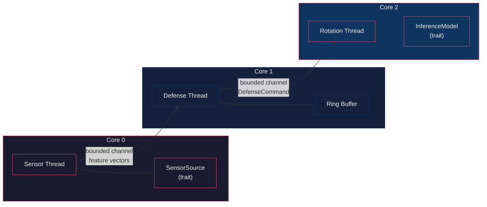

# EDGE

**E**fficient **D**efense via **G**ivens rotatio**n**s — a three-thread, budget-gated
adversarial defense for TinyML classifiers on ARM Cortex-A76.

[](https://www.rust-lang.org)
[](#)

---

## Overview

EDGE is the reference implementation of the **MIDAS-Edge** pipeline described in an
IEEE ICCD 2026 paper draft. It protects a TinyML image/tabular classifier against
adversarial examples by continuously rotating the decision manifold in reaction to
observed feature trajectories.

The core insight is a **dual-phase rotation schedule**:

| Phase | Condition | Rotation angle |
|-------|-----------|----------------|
| **Archimedean** | `epsilon_p <= gamma` | `delta_theta = lambda * epsilon_p` |
| **Logarithmic** | `epsilon_p > gamma` | `delta_theta = min(lambda * exp(k * (epsilon_p - gamma)), delta_theta_max)` |

A **budget-gated** fallback ensures real-time guarantees: if the Givens rotation
exceeds the SLA budget, the sample is projected onto the unrotated base manifold
instead of being dropped.

## Architecture



- **Core 0** — receives feature vectors (TCP/UART mock behind a trait, swappable for
  real hardware).
- **Core 1** — owns the ring buffer, computes cosine-similarity momentum
  `M_t = cos_sim(v_t, v_{t-1})` and penetration epsilon
  `epsilon_p = ||v_t - v_{t-1}||_2 * max(0, M_t)`, decides the rotation angle.
- **Core 2** — applies a budget-gated Givens rotation, runs inference through the
  `InferenceModel` trait, records latency.
- **Core 3** — reserved (unpinned).

## Quick start

```bash
# Run the three-thread pipeline with MockModel (200 synthetic samples)
EDGE_CONFIG=configs/edge_config.json cargo run --bin edge

# Generate LaTeX-ready report tables (CSV + JSON)
cargo run --bin edge -- harness

# Both sequentially
cargo run --bin edge -- all
```

## Crate layout

| Crate | Type | Responsibility |
|-------|------|----------------|
| [`edge-core`](./edge-core) | lib | Ring buffer, trajectory math (`compute_momentum`, `penetration_epsilon`), rotation math (`rotate_manifold_givens`, `project_to_manifold`, `budget_gated_rotation`), config deserialization |
| [`edge`](./edge) | bin | Three-thread runtime, `InferenceModel` trait, `MockModel`/`TfliteModel`, attack harness (PGD, FGSM, C&W), CSV dataset loader, LaTeX-ready report writers |

## Python Shadow Model (`shadow/`)

A Python implementation of the defense is provided in the `shadow/` directory for rapid prototyping, gradient testing, and vulnerability analysis.

### Key Components
- **`defense.py`**: Python equivalent of the budget-gated Givens rotation defense.
- **`run_attacks.py`**: Harness for running naive and adaptive PGD/FGSM attacks against the shadow model.
- **`test_gradients.py`**: Verifies gradient flow through the defense mechanism.

### Diagnostics & Trajectory Verification
Several scripts are included to analyze the model's vulnerability and verify rotation trajectories:
- **`diagnose_mlp.py`**: Vulnerability checks for MLP surrogates using PGD attacks, including saturation analysis.
- **`probe_alpha001.py`**: Probes the effects of smaller step sizes (`alpha`) on adaptive vs. naive attack success rates.
- **`diagnose_delta_theta.py`**: Analyzes the generated rotation angles (`delta_theta`).
- **`verify_epsilon_p.py`**: Verifies penetration epsilon (`epsilon_p`) trajectories, cosine similarity distributions, and gamma placement.
- **`check4_corrected.py`**: Corrected evaluation script for verifying trajectory generation.

## Configuration

All hyperparameters from the paper are in [`configs/edge_config.json`](./configs/edge_config.json):

| Field | Default | Description |
|-------|---------|-------------|
| `W` | `10` | Ring buffer window size |
| `D` | `42` | Feature vector dimension |
| `gamma` | `2.3061` | Phase transition threshold (recalibrated = benign P95; was erroneously `0.292` synthetic / `1.984` P75, corrected to P95 per the paper rule) |
| `lambda` | `1.0` | Rotation scaling factor |
| `k` | `2.0` | Logarithmic growth rate |
| `tau` | `0.75` | Similarity threshold |
| `delta_theta_max_deg` | `45.0` | Maximum rotation angle |
| `sla_budget_ms` | `50` | Budget-gating deadline (Edge tier `T_SLA=50ms`; MCU tier is `10ms`) |
| `channel_capacity` | `4` | Bounded channel size |

Each field is validated against recommended ranges at startup.

## TFLite inference (production classifier)

The deployed classifier is a 3.1–4.5 KB TFLite MLP (`d=42 → hidden=16, tanh,
sigmoid`) exported from the PyTorch surrogate by
[`shadow/export_surrogate_to_tflite.py`](./shadow/export_surrogate_to_tflite.py).
Artifacts live in [`models/`](./models); see `models/export_report.json` for
per-artifact sizes and Python-interpreter verification.

Rust FFI bindings to the TensorFlow Lite **C API** are implemented in
[`edge/src/tflite_ffi.rs`](./edge/src/tflite_ffi.rs) +
[`edge/src/model.rs`](./edge/src/model.rs) behind the `tflite` feature.
Vendored prebuilt runtimes (v2.17.1, XNNPACK, from
[tphakala/tflite_c](https://github.com/tphakala/tflite_c/releases)):

- `edge/vendor/tflite/x86_64/libtensorflowlite_c.so`
- `edge/vendor/tflite/aarch64/libtensorflowlite_c.so`  ← Raspberry Pi 5

```bash
# FFI validation against PyTorch reference vectors
.venv/bin/python shadow/gen_ffit_vectors.py
cargo run --release -p edge --bin tflite_validate --features tflite -- \
    models/classifier_fp16.tflite results/ffi_vectors.json results/ffi_validation_fp16.json

# Run the live three-thread pipeline on the real model (falls back to MockModel
# without --features tflite or if loading fails)
EDGE_MODEL_PATH=models/classifier_fp16.tflite \
    cargo run --release --features tflite --bin edge
```

Cross-language validation (PyTorch vs Python interpreter vs Rust FFI) shows
max |Δp| = 1.9e-6 for float32/dynamic-int8 and 1.9e-3 for fp16 with zero label
flips. On-device latency is far inside the 50 ms Edge SLA on both platforms. Note
the p50/p99-swap is real and expected: the median (p50) is governed by the FP
Givens-rotation/manifold path, which runs ~2× slower on the Pi's Cortex-A76
than on x86_64, while the tail (p99/max) reflects warmup + noise, which is
lower and tighter on the Pi. See `results/latency_reproducibility.json` for the
full per-run breakdown; both platforms are comfortably ≤ 0.1 ms at the tail.

## MCU Tier (`mcu/` + `configs/mcu_config.json`)

The MCU tier mirrors the Edge tier's layout: host-side build/vulnerability scripts
in `mcu/scripts/` (parallel to `shadow/`), timestamped result captures in
`mcu/results/` (parallel to `shadow/results/`), trained surrogate weights in
`mcu/trained_weights/`, diagnostics in `mcu/scratch/`, the TFLM firmware
targeting the STM32F407VG Discovery board (Cortex-M4F, 168 MHz, 192 KB SRAM,
1 MB flash) in `mcu/fw/`, and shared feature artifacts in `mcu/features/`.

Host-side pipeline (in run order):
- **`map_features.py`** → **`unify_categoricals.py`** → **`fit_unified_scaler.py`**:
  map NSL-KDD + UNSW-NB15 onto a shared 12-dim overlap feature space, unify
  categorical encodings, fit the min/max scaler. Emits `mcu/features/unified_*.npy`.
- **`downselect_dims.py`**: train a structure probe surrogate and pick the 12
  retained dims (matching Edge `d=42` semantics at MCU scale).
- **`qat_export_specialists.py`**: per-source QAT INT8 specialists
  (`d=12→16→1`, tanh→sigmoid) exported to `models/mcu_specialist_{nsl,unsw}_{int8,fp32}.tflite`.
- **`recalibrate_gamma.py`**: per-source `gamma` = clean-benign `epsilon_p` P95
  (NSL 0.970, UNSW 0.613 — the Edge `gamma=2.3061` does not transfer), plus FPR.
- **`adaptive_attacker_gate.py`**: instruction-accurate INT8 replica
  (QAT-style straight-through) of the deployed TFLM specialists; reproduces the
  Edge gate (vulnerable-basis naive-vs-adaptive `gap > 0.02` → fixed-basis).
- **`recheck_gate_n800.py`**: Edge sample-size discipline (mirror of
  `shadow/recheck_n200.py`) — every gate config re-run on fresh seeded pools
  at N=800 with the `|gap|>0.02 AND gap/SE>1.0` rule.
- **`train_routing_gate.py`**: the mechanism that makes 0.8766 "routed
  deployment accuracy" real. "Provenance" is a training-data origin label a
  live sensor never sees, so a three-component deployment needs an actual
  router. A ridge-logistic gate on the same 12-dim frame (12×1 FC + logistic
  LUT, 21 B SRAM, ~0.0008 ms) rebuilds provenance from features at inference
  time: 99.9988% routing accuracy (1 misroute / 81,239 held-out rows) and
  gate-routed deployment accuracy == oracle-provenance == **0.8766**, with a
  zero-luck explanation (the single misrouted row still classified correctly).
  The two manifolds are linearly separable (dims 1 and 9 carry it) — the same
  fact that explains the 0.34/0.52 cross-generalization failure below. Gate
  robustness, precisely defined in the report: (i) ADVERSARIAL metric — a
  worst-case ε-ball in the gate's standardized-feature space (per-query
  move perpendicular to the decision plane) misroutes 4.1%/6.7%/30.3% of
  queries at ε=0.08/0.10/0.125; verified by direct perturbation; observed
  routing error is still only 1/81,239 because violations need the
  adversarial direction. (ii) GEOMETRIC reference, deliberately NOT an
  attack metric — a per-query push a fraction t of the way to the *other*
  source's centroid (heuristic direction, huge magnitude) collapses routing
  only at t≈0.5. The mechanism→feature attack path is untested and flagged
  in Limitations as a new architecture-specific surface.
- **`fw_cycle_model.py`**: analytical per-invocation latency from the actual
  INT8 op graphs (TFLite flatbuffer) on Cortex-M4F @168 MHz.

Gate verdict (committed in `mcu/features/attacker_gate_report.json` +
`mcu/results/recheck_gate_n800_*.json`), N=200 gate then N=800 recheck:

| Source | Coupled-basis (known-vuln control) | Fixed-basis | Verdict |
|--------|------------------------------------|-------------|---------|
| **NSL** (γ=0.970) | gap +0.153..+0.326, **Gap/SE 9–15** | +0.025..+0.045 → +0.025..0 (eps0.2_100 residual small edge, Gap/SE 1.33) | **PASS** (caveat: not perfectly flat at harshest budget) |
| **UNSW** (γ=0.613) | gap ≤0.065 at N=200 → **collapses to noise** at N=800 (max +0.019, Gap/SE ≤0.75) | flat | **NOT confirmed** (reportable per-source finding — coupled-basis vulnerability absent on UNSW data; harness sensitivity validated by the NSL control) |

The NSL specialist is validated: its replica bit-matches the TFLite
interpreter (600/600 samples), and the known-vulnerability signal registers
unambiguously at high N. The UNSW specialist shows no attacker-coupled-basis
advantage, which is reported as a per-source behavioral difference — not an
absence claim for the harness as a whole.

Deployment is a **three-component pipeline** (per Section VI-A/VII-A rewrite):
**routing gate → {NSL-spec, UNSW-spec}**. `eval_specialists_cross.py`
quantifies why specialization is required, not aesthetic: each deployed INT8
specialist is accurate same-source (NSL 0.9091, UNSW 0.8578) but collapses
cross-source (NSL-spec on UNSW rows 0.3436, UNSW-spec on NSL rows 0.5213) —
a single merged classifier genuinely does not generalize across the two
datasets, and the gate above reconstructs provenance from features at
inference time so the two specialists are always routed correctly. Routed
deployment accuracy **0.8766** (mechanism-backed: gate-routed, not
oracle-labeled; see `mcu/features/routing_gate_report.json` +
`mcu/features/specialists_cross_eval.json`).

Every experimental script writes a timestamped, git-hashed capture to
`mcu/results/<script>_<timestamp>.json` via `mcu/scripts/save_results.py`
(mirror of `shadow/save_results.py`).

All MCU-tier hyperparameters live in
[`configs/mcu_config.json`](./configs/mcu_config.json) (mirror of
`configs/edge_config.json`): `W=10`, `D=12`, per-source `gamma`, `lambda=1.0`,
`k=2.0`, `delta_theta_max_deg=45`, `sla_budget_ms=10` (MCU SLA).

### Firmware

`mcu/fw/` is a bare-metal TFLM build for the DISCO-F407VG, flashed and measured
on the real board over SWD (built with `make` in `mcu/fw/`; produces
`build/mcu_fw.{elf,bin,hex}` plus `build/mcu_fw.map`; flashed via
`st-flash write build/mcu_fw.bin 0x08000000`). Measured: **Flash 60.9 KB
(5.9% of 1 MB)**, **on-device SRAM 18.7 KB (9.7% of 192 KB)** incl. 16 KB TFLM
arena (1,050 B of benchmark DWT-capture arrays are non-production and separated
in the reconciliation), both int8 specialists 2,528 B each. Hardware I/O is
decoupled via USART2: a **DMA RX ring buffer** (Item 6, **DMA1 Stream5
circular** — the correct USART2_RX mapping — + IDLE-line framing) ingests host
feature vectors bypassing the CPU, feeds a W=10 float window for the defense,
and quantizes the latest vector into the INT8 input tensor.

**Measured on-device latency (SWD).** The routing gate, delta-theta defense
and fixed-basis rotation are now **implemented in firmware** (not just modeled):
per frame the pipeline runs DMA-IDLE ingest + ASCII parse + window push
(T_sense), windowed penetration `eps` + `rotation_angle(eps)` (T_theta), the
folded 12×1 gate FC + logistic LUT + route (T_gate; standardization folded
into the weights offline, sign-agree 1.0 vs the host), the fixed-basis Givens
rotation (T_rotate), then quantizes the rotated vector and invokes the
*routed* specialist (T_inf). Each stage is timestamped with the DWT cycle
counter into SRAM and read back over SWD; 50 frames over 4 real feature seeds
(25 routed to each specialist). Counter certified two ways (DWT↔SysTick ±3 cyc
over 8.43e6; rate ≈ 168.6 MHz vs host clock). Result:

| stage | mean cyc | ms |
|---|---|---|
| T_sense (IDLE + parse + window + quantize) | 4,705 | 0.0279 |
| T_theta (penetration + angle) | 284 | 0.0017 |
| T_gate (folded FC + logistic LUT + route) | 117 | 0.0007 |
| T_rotate (fixed-basis Givens, newlib cos/sin) | 839 | 0.0050 |
| T_inf (routed INT8 specialist, rotated input) | 16,320 | 0.0968 |
| **full path/frame** | **22,266** | **0.1321 = 1.32% of 10 ms** |

The analytical `fw_cycle_model.py` typical (10,216 cyc) now under-predicts the
measured full path by **2.18×**: T_sense/T_theta/T_gate land close to the
estimates, while T_rotate real cost (839 cyc, dominated by newlib `cosf`/`sinf`)
is ~5× the naive 168-cyc bookkeeping, and T_inf on *rotated real features*
(~16.3 kcyc) runs a bit above the earlier dummy-input 15,719/15,718 cyc
(retained as the per-specialist Invoke reference). Methodology notes: the
board's ST-Link VCP (COM4) is not physically wired to USART2 (UM1472), so
console output is captured over SWD rather than UART; the GPIO-toggle-vs-DWT
leg of the cross-check (a scope-timed pulse) still needs an external logic
analyzer, but the on-chip DWT↔SysTick agreement and the host-clock rate probe
already certify the counter.

## Tests

```bash
cargo test
```

18 unit tests covering momentum computation, penetration epsilon (orthogonal,
anti-aligned, zero-norm edge cases), Givens rotation, phase boundary, budget-gated
fallback, ring buffer eviction, and CSV dataset loading.

## TODO

- [x] Real TFLite C++ FFI (`libtensorflowlite_c.so`) behind `--features tflite`
- [x] PyTorch surrogate → TFLite export (float32 / fp16 / dynamic-int8 / full-int8)
- [ ] Load manifold centroid from `config.manifold_path` (file exists at `data/manifold_real.npy`)
- [ ] Full C&W L2 attack implementation
- [x] MCU tier: QAT for full-INT8 (naive PTQ loses 2.1 pp on the saturated surrogate); TFLM conversion + firmware build (53.4 KB flash / 17.4 KB SRAM incl. DMA RX ring + window)
- [x] MCU tier: measured on-device DWT cycle counts via SWD — T_inf = 15,719/15,718 cyc (~0.094 ms) per specialist, stdev 0 over 50 runs; DWT↔SysTick agree ±3 cyc over 8.4e6; counter rate ≈168.6 MHz vs host clock; analytical fw_cycle_model.py (0.035 ms) is a 2.65× underestimate; GPIO-toggle-vs-DWT scope leg still pending external logic analyzer
- [x] MCU tier: on-device defense pipeline (gate + theta + fixed-basis rotation + routed Invoke) DWT-measured per stage over 50 frames — T_sense 4,705 / T_theta 284 / T_gate 117 / T_rotate 839 / T_inf 16,320 cyc, full path 0.1321 ms = 1.32% of 10 ms SLA; also fixed the latent USART2_RX stream (now DMA1 Stream5 Ch4 — the old macro addressed DMA1 Str6 w/ DMA1 unclocked, dropping all writes) revealed by the on-device ingest trace
- [x] MCU tier: adaptive-attacker gate + high-N recheck (Edge sample-size discipline); NSL PASS w/ caveat, UNSW not confirmed (per-source finding) — `mcu/results/adaptive_attacker_gate_20260906T180829Z.json`, `mcu/results/recheck_gate_n800_*.json`
- [ ] Experimental results (partially populated in `results/`)

## License

MIT
