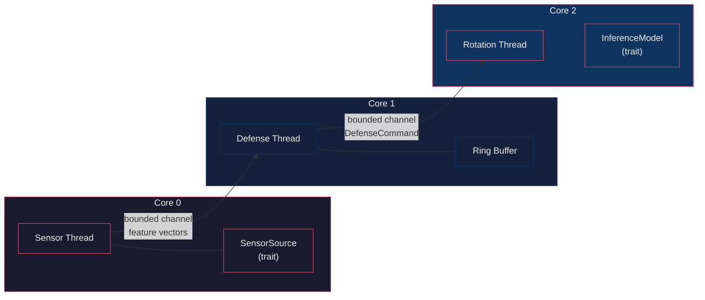

# EDGE

**E**fficient **D**efense via **G**ivens rotatio**n**s — a three-thread, budget-gated
adversarial defense for TinyML classifiers on ARM Cortex-A76.

[](https://www.rust-lang.org)
[](#)

---

## Overview

EDGE is the reference implementation of the **MIDAS-Edge** pipeline described in an
IEEE ICCD 2026 paper draft. It protects a TinyML image/tabular classifier against
adversarial examples by continuously rotating the decision manifold in reaction to
observed feature trajectories.

The core insight is a **dual-phase rotation schedule**:

| Phase | Condition | Rotation angle |
|-------|-----------|----------------|
| **Archimedean** | `epsilon_p <= gamma` | `delta_theta = lambda * epsilon_p` |
| **Logarithmic** | `epsilon_p > gamma` | `delta_theta = min(lambda * exp(k * (epsilon_p - gamma)), delta_theta_max)` |

A **budget-gated** fallback ensures real-time guarantees: if the Givens rotation
exceeds the SLA budget, the sample is projected onto the unrotated base manifold
instead of being dropped.

## Architecture



- **Core 0** — receives feature vectors (TCP/UART mock behind a trait, swappable for
  real hardware).
- **Core 1** — owns the ring buffer, computes cosine-similarity momentum
  `M_t = cos_sim(v_t, v_{t-1})` and penetration epsilon
  `epsilon_p = ||v_t - v_{t-1}||_2 * max(0, M_t)`, decides the rotation angle.
- **Core 2** — applies a budget-gated Givens rotation, runs inference through the
  `InferenceModel` trait, records latency.
- **Core 3** — reserved (unpinned).

## Quick start

```bash
# Run the three-thread pipeline with MockModel (200 synthetic samples)
EDGE_CONFIG=configs/edge_config.json cargo run --bin edge

# Generate LaTeX-ready report tables (CSV + JSON)
cargo run --bin edge -- harness

# Both sequentially
cargo run --bin edge -- all
```

## Crate layout

| Crate | Type | Responsibility |
|-------|------|----------------|
| [`edge-core`](./edge-core) | lib | Ring buffer, trajectory math (`compute_momentum`, `penetration_epsilon`), rotation math (`rotate_manifold_givens`, `project_to_manifold`, `budget_gated_rotation`), config deserialization |
| [`edge`](./edge) | bin | Three-thread runtime, `InferenceModel` trait, `MockModel`/`TfliteModel`, attack harness (PGD, FGSM, C&W), CSV dataset loader, LaTeX-ready report writers |

## Python Shadow Model (`shadow/`)

A Python implementation of the defense is provided in the `shadow/` directory for rapid prototyping, gradient testing, and vulnerability analysis.

### Key Components
- **`defense.py`**: Python equivalent of the budget-gated Givens rotation defense.
- **`run_attacks.py`**: Harness for running naive and adaptive PGD/FGSM attacks against the shadow model.
- **`test_gradients.py`**: Verifies gradient flow through the defense mechanism.

### Diagnostics & Trajectory Verification
Several scripts are included to analyze the model's vulnerability and verify rotation trajectories:
- **`diagnose_mlp.py`**: Vulnerability checks for MLP surrogates using PGD attacks, including saturation analysis.
- **`probe_alpha001.py`**: Probes the effects of smaller step sizes (`alpha`) on adaptive vs. naive attack success rates.
- **`diagnose_delta_theta.py`**: Analyzes the generated rotation angles (`delta_theta`).
- **`verify_epsilon_p.py`**: Verifies penetration epsilon (`epsilon_p`) trajectories, cosine similarity distributions, and gamma placement.
- **`check4_corrected.py`**: Corrected evaluation script for verifying trajectory generation.

## Configuration

All hyperparameters from the paper are in [`configs/edge_config.json`](./configs/edge_config.json):

| Field | Default | Description |
|-------|---------|-------------|
| `W` | `10` | Ring buffer window size |
| `D` | `42` | Feature vector dimension |
| `gamma` | `2.3061` | Phase transition threshold (recalibrated = benign P95; was erroneously `0.292` synthetic / `1.984` P75, corrected to P95 per the paper rule) |
| `lambda` | `1.0` | Rotation scaling factor |
| `k` | `2.0` | Logarithmic growth rate |
| `tau` | `0.75` | Similarity threshold |
| `delta_theta_max_deg` | `45.0` | Maximum rotation angle |
| `sla_budget_ms` | `50` | Budget-gating deadline (Edge tier `T_SLA=50ms`; MCU tier is `10ms`) |
| `channel_capacity` | `4` | Bounded channel size |

Each field is validated against recommended ranges at startup.

## TFLite inference (production classifier)

The deployed classifier is a 3.1–4.5 KB TFLite MLP (`d=42 → hidden=16, tanh,
sigmoid`) exported from the PyTorch surrogate by
[`shadow/export_surrogate_to_tflite.py`](./shadow/export_surrogate_to_tflite.py).
Artifacts live in [`models/`](./models); see `models/export_report.json` for
per-artifact sizes and Python-interpreter verification.

Rust FFI bindings to the TensorFlow Lite **C API** are implemented in
[`edge/src/tflite_ffi.rs`](./edge/src/tflite_ffi.rs) +
[`edge/src/model.rs`](./edge/src/model.rs) behind the `tflite` feature.
Vendored prebuilt runtimes (v2.17.1, XNNPACK, from
[tphakala/tflite_c](https://github.com/tphakala/tflite_c/releases)):

- `edge/vendor/tflite/x86_64/libtensorflowlite_c.so`
- `edge/vendor/tflite/aarch64/libtensorflowlite_c.so`  ← Raspberry Pi 5

```bash
# FFI validation against PyTorch reference vectors
.venv/bin/python shadow/gen_ffit_vectors.py
cargo run --release -p edge --bin tflite_validate --features tflite -- \
    models/classifier_fp16.tflite results/ffi_vectors.json results/ffi_validation_fp16.json

# Run the live three-thread pipeline on the real model (falls back to MockModel
# without --features tflite or if loading fails)
EDGE_MODEL_PATH=models/classifier_fp16.tflite \
    cargo run --release --features tflite --bin edge
```

Cross-language validation (PyTorch vs Python interpreter vs Rust FFI) shows
max |Δp| = 1.9e-6 for float32/dynamic-int8 and 1.9e-3 for fp16 with zero label
flips. On-device latency is far inside the 50 ms Edge SLA on both platforms. Note
the p50/p99-swap is real and expected: the median (p50) is governed by the FP
Givens-rotation/manifold path, which runs ~2× slower on the Pi's Cortex-A76
than on x86_64, while the tail (p99/max) reflects warmup + noise, which is
lower and tighter on the Pi. See `results/latency_reproducibility.json` for the
full per-run breakdown; both platforms are comfortably ≤ 0.1 ms at the tail.

## Tests

```bash
cargo test
```

18 unit tests covering momentum computation, penetration epsilon (orthogonal,
anti-aligned, zero-norm edge cases), Givens rotation, phase boundary, budget-gated
fallback, ring buffer eviction, and CSV dataset loading.

## TODO

- [x] Real TFLite C++ FFI (`libtensorflowlite_c.so`) behind `--features tflite`
- [x] PyTorch surrogate → TFLite export (float32 / fp16 / dynamic-int8 / full-int8)
- [ ] Load manifold centroid from `config.manifold_path` (file exists at `data/manifold_real.npy`)
- [ ] Full C&W L2 attack implementation
- [ ] MCU tier: QAT for full-INT8 (naive PTQ loses 2.1 pp on the saturated surrogate), TFLM conversion, cycle counts
- [ ] Experimental results (partially populated in `results/`)

## License

MIT
