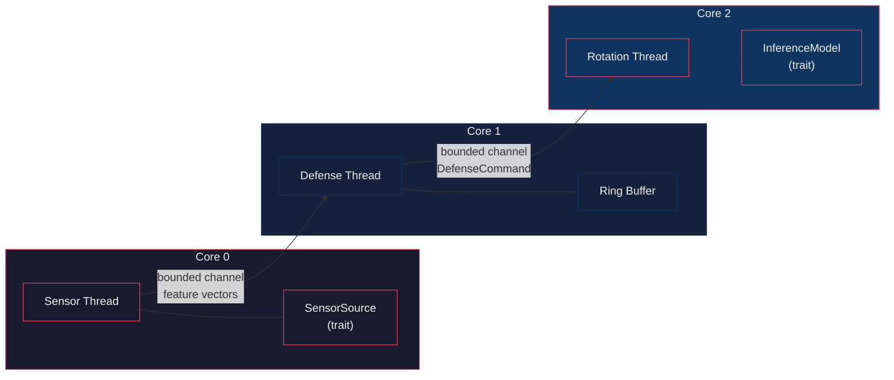

# EDGE

**E**fficient **D**efense via **G**ivens rotatio**n**s — a budget-gated
adversarial defense for TinyML classifiers, evaluated on ARM Cortex-A76
(Raspberry Pi 5) and Cortex-M4F (STM32F407 Discovery).

[](https://www.rust-lang.org)
[](#)

---

## 1. Overview

MIDAS-Edge is the pipeline described in the IEEE ICCD 2026 paper draft. It
protects a lightweight classifier against adversarial examples by **continuously
rotating the decision manifold** in reaction to observed feature trajectories.

The defense uses a **dual-phase rotation schedule** driven by a running estimate
of penetration `epsilon_p`:

| Phase | Condition | Rotation angle |
|-------|-----------|----------------|
| **Archimedean** | `epsilon_p <= gamma` | `delta_theta = lambda * epsilon_p` |
| **Logarithmic** | `epsilon_p > gamma` | `delta_theta = min(lambda * exp(k * (epsilon_p - gamma)), delta_theta_max)` |

A **budget-gated fallback** preserves real-time guarantees: when the Givens
rotation would exceed the SLA budget, the sample is projected onto the unrotated
base manifold instead of dropped.

The repository is organized in **three mirrored tiers**, designed so host-side
analysis and embedded firmware stay in lockstep:

| Tier | Code | Target |
|------|------|--------|
| **Edge** | Rust (`edge/`, `edge-core/`) | 3-thread pipeline on x86_64 / ARMv8-A (Raspberry Pi 5) |
| **Shadow** | Python (`shadow/`) | PyTorch surrogate, gradient attack harness, TFLite export |
| **MCU** | Python scripts (`mcu/scripts/`) + bare-metal firmware (`mcu/fw/`) | INT8 TFLM specialists on STM32F407 |

## 2. Architecture



- **Core 0** — receives feature vectors (TCP/UART behind a trait, swappable for
  real hardware).
- **Core 1** — owns the ring buffer; computes cosine momentum
  `M_t = cos_sim(v_t, v_{t-1})` and penetration
  `epsilon_p = ||v_t - v_{t-1}||_2 * max(0, M_t)`, then decides the rotation angle.
- **Core 2** — applies the budget-gated Givens rotation and runs inference
  through the `InferenceModel` trait; records latency.
- **Core 3** — reserved (unpinned).

See [`docs/ARCHITECTURE.md`](docs/ARCHITECTURE.md) for the full runtime design
and defense math.

## 3. Quick start

```bash
# Edge tier: three-thread pipeline with MockModel (200 synthetic samples)
EDGE_CONFIG=configs/edge_config.json cargo run --bin edge

# TFLite production classifier (falls back to MockModel on load failure)
EDGE_MODEL_PATH=models/classifier_fp16.tflite \
    cargo run --release --features tflite --bin edge

# Generate LaTeX-ready report tables (CSV + JSON)
cargo run --bin edge -- harness
```

MCU tier firmware builds in `mcu/fw/` (`make` → `build/mcu_fw.{elf,bin,hex}`);
flash with `st-flash write build/mcu_fw.bin 0x08000000`. Reproducible on-device
measurement recipe: [`docs/mcu-measurement-procedure.md`](docs/mcu-measurement-procedure.md).

## 4. Repository layout

| Path | Content |
|------|---------|
| [`edge-core/`](./edge-core) | Ring buffer, trajectory math (`compute_momentum`, `penetration_epsilon`), rotation math (`rotate_manifold_givens`, `project_to_manifold`, `budget_gated_rotation`), config deserialization |
| [`edge/`](./edge) | Three-thread runtime, `InferenceModel` trait, `MockModel`/`TfliteModel`, attack harness (PGD, FGSM, C&W), CSV loader, report writers; TFLite C FFI behind the `tflite` feature |
| [`shadow/`](./shadow) | Python defense (`defense.py`), attack harness (`run_attacks.py`), gradient checks, diagnostics, TFLite export |
| [`mcu/scripts/`](./mcu/scripts) | Host-side MCU pipeline: feature mapping, QAT INT8 specialists, gate + recheck, W ablation, baseline battery, latency model |
| [`mcu/fw/`](./mcu/fw) | Bare-metal TFLM firmware for DISCO-F407VG (Cortex-M4F, 168 MHz) |
| [`configs/`](./configs) | `edge_config.json` (d=42) + `mcu_config.json` (d=12) hyperparameters |

## 5. Configuration

All hyperparameters are validated against recommended ranges at startup.
Edge: [`configs/edge_config.json`](./configs/edge_config.json).
MCU: [`configs/mcu_config.json`](./configs/mcu_config.json) (mirror, `W=10`,
`D=12`, per-source `gamma`, `sla_budget_ms=10`).

| Field | Edge default | Description |
|-------|--------------|-------------|
| `W` | `10` | Ring buffer window size |
| `D` | `42` | Feature vector dimension (MCU: `12`) |
| `gamma` | `2.3061` | Phase transition threshold = benign `epsilon_p` P95 (per-source on MCU: NSL 0.970, UNSW 0.613) |
| `lambda` | `1.0` | Rotation scaling factor |
| `k` | `2.0` | Logarithmic growth rate |
| `tau` | `0.75` | Similarity threshold |
| `delta_theta_max_deg` | `45.0` | Maximum rotation angle |
| `sla_budget_ms` | `50` | Budget-gating deadline (MCU: `10`) |
| `channel_capacity` | `4` | Bounded channel size |

## 6. Models & inference

The deployed classifier is a 3.1–4.5 KB TFLite MLP (`d=42 → hidden=16`, tanh,
sigmoid) exported from the PyTorch surrogate by
[`shadow/export_surrogate_to_tflite.py`](./shadow/export_surrogate_to_tflite.py);
artifacts and per-artifact sizes/verification in [`models/`](./models).

Rust FFI bindings to the TensorFlow Lite **C API** live in
[`edge/src/tflite_ffi.rs`](./edge/src/tflite_ffi.rs) + [`edge/src/model.rs`](./edge/src/model.rs)
behind the `tflite` feature (vendored v2.17.1 XNNPACK prebuilts for x86_64 and aarch64).

Cross-language validation (PyTorch vs Python interpreter vs Rust FFI): max
|Δp| = 1.9e-6 float32/dynamic-int8, 1.9e-3 fp16, zero label flips at both
precisions. On-device latency is far inside the 50 ms Edge SLA on x86_64 and
Raspberry Pi 5; details in `results/latency_reproducibility.json`.

## 7. MCU tier

The MCU tier mirrors the Edge layout: host build/vulnerability scripts
(`mcu/scripts/`), timestamped + git-hashed result captures (`mcu/results/`),
trained weights (`mcu/trained_weights/`), shared feature artifacts
(`mcu/features/`), and bare-metal firmware (`mcu/fw/`).

### 7.1 Pipeline (host side, in run order)

1. **Feature mapping** `map_features.py` → `unify_categoricals.py` →
   `fit_unified_scaler.py` — NSL-KDD + UNSW-NB15 onto a shared 12-dim overlap
   feature space → `mcu/features/unified_*.npy`.
2. **`downselect_dims.py`** — structure probe selects the 12 retained dims
   (Edge `d=42` semantics at MCU scale).
3. **`qat_export_specialists.py`** — per-source QAT INT8 specialists
   (`d=12→16→1`) → `models/mcu_specialist_{nsl,unsw}_{int8,fp32}.tflite`.
4. **`recalibrate_gamma.py`** — per-source `gamma` = clean-benign `epsilon_p`
   P95 (NSL 0.970, UNSW 0.613) + FPR.
5. **`adaptive_attacker_gate.py`** — instruction-accurate INT8 replica of the
   deployed specialists; reproduces the Edge gate
   (vulnerable-basis naive-vs-adaptive `gap > 0.02` → fixed-basis).
6. **`recheck_gate_n800.py`** — Edge sample-size discipline: every config
   re-run at N=800 under the `|gap|>0.02 AND gap/SE>1.0` rule.
7. **`train_routing_gate.py`** — the mechanism behind the **0.8766 routed
   deployment accuracy**: a ridge-logistic gate on the same 12-dim frame
   (12×1 FC + logistic LUT, 21 B SRAM, ~0.0008 ms) replans provenance from
   features at inference time → 99.9988% routing accuracy (1/81,239), routed
   accuracy == oracle-provenance == **0.8766**.
8. **`fw_cycle_model.py`** — analytical per-invocation latency from the actual
   INT8 op graphs on Cortex-M4F @ 168 MHz.

**Deployment is a three-component pipeline** — routing gate → {NSL-spec,
UNSW-spec}. Specialization is required, not aesthetic: each INT8 specialist is
accurate same-source (NSL 0.9091, UNSW 0.8578) but collapses cross-source
(0.3436 / 0.5213); the gate reconstructs provenance so both are always routed
correctly. See `mcu/features/routing_gate_report.json` +
`mcu/features/specialists_cross_eval.json`.

### 7.2 Adaptive-vulnerability gate verdict

N=200 gate then N=800 recheck (`mcu/features/attacker_gate_report.json`):

| Source | Coupled-basis (known-vuln control) | Fixed-basis | Verdict |
|--------|------------------------------------|-------------|---------|
| **NSL** (γ=0.970) | gap +0.153..+0.326, **Gap/SE 9–15** | +0.025..+0.045 → +0.025..0 (eps0.2_100 residual, Gap/SE 1.33) | **PASS** (caveat: not perfectly flat at harshest budget) |
| **UNSW** (γ=0.613) | gap ≤0.065 at N=200 → **collapses to noise** at N=800 (max +0.019, Gap/SE ≤0.75) | flat | **NOT confirmed** |

The NSL specialist is validated — its replica bit-matches the TFLite
interpreter (600/600), and the known-vulnerability signal registers
unambiguously at high N. The UNSW specialist shows no attacker-coupled-basis
advantage; a per-source behavioral difference, not an absence claim for the
harness. The natural geometric explanation (gradient-to-query alignment) was
measured and **refuted**: UNSW's loss-gradient energy inside the coupled
subspace is *higher* (0.692 vs NSL 0.279), the opposite of the prediction.
Decision recorded in **ADR-0006**.

### 7.3 Baseline battery (per deployed INT8 specialist)

DACM, input-smoothing, Chen query-blinding, and adversarially trained baselines
vs the deployed INT8 specialists, **n=100/source** (`mcu/features/mcu_tier_baselines.json`):

| Defense | PGD (NSL / UNSW) | Notes |
|---------|------------------|-------|
| Undefended | 0.08 / 0.13 | defense-success |
| **DACM (MIDAS rotation)** | 0.06 / 0.04 | cheaply defeated — mirrors Edge 0.06 |
| **Chen query-blinding** | 0.44 / 0.30 | strongest on-device baseline (counts its own rejection) |
| Input-smoothing | 0.0 / 0.0 | fully defeated on-device |
| Adv-trained | 0.0 / 0.05 | |

On C&W-L2 the INT8 specialist is invariant — every defense-success = 1.000
(0 flips, including the continuous dequant replica), consistent with Edge's
float undefended 0.945 defense-success; a degenerate sensitivity, so PGD is the
discriminating axis.

Ring-buffer **W ablation** (W ∈ {2,3,4,6,8,10}): the NSL gate passes at every
W (vulnerable gaps +0.13..+0.41 stable) — the control and defense are
window-size invariant. UNSW verdicts flutter ±0.05 around the N=200 rule —
sampling noise, not a W effect. Ring-buffer SRAM = (W−1)·d·4 B.

### 7.4 Firmware & measured on-device performance

Bare-metal TFLM build for the DISCO-F407VG, flashed over SWD (see ADR-0003/0004
and the [measurement procedure](docs/mcu-measurement-procedure.md)):

- **Memory** — Flash 60.9 KB (5.9% of 1 MB); on-device SRAM 18.7 KB (9.7% of
  192 KB) incl. 16 KB TFLM arena (1,050 B of non-production DWT capture arrays
  separated in the reconciliation), both INT8 specialists 2,528 B each.
- **Ingest** — USART2 DMA RX ring buffer (**DMA1 Stream5 Ch4** circular +
  IDLE framing) bypasses the CPU; `W=10` float window; INT8 input quantization.
- **Latency** — the routing gate, delta-theta defense and fixed-basis rotation
  are implemented in firmware (not just modeled); every stage is DWT-timestamped
  into SRAM and read back over SWD. 50 frames over 4 real feature seeds, 25 per
  specialist. Counter certified two ways (DWT↔SysTick ±3 cyc over 8.4e6; rate
  ≈168.0 MHz vs Saleae Logic 8, <0.05% error):

| Stage | Mean cyc | ms |
|---|---|---|
| T_sense (IDLE + parse + window + quantize) | 4,705 | 0.0279 |
| T_theta (penetration + angle) | 284 | 0.0017 |
| T_gate (folded FC + logistic LUT + route) | 117 | 0.0007 |
| T_rotate (fixed-basis Givens, newlib cos/sin) | 839 | 0.0050 |
| T_inf (routed INT8 specialist, rotated input) | 16,320 | 0.0968 |
| **Full path/frame** | **22,266** | **0.1321 = 1.32% of 10 ms** |

Note the board's ST-Link VCP is not physically wired to USART2 (UM1472 §6.1.3),
so console output is captured over SWD. Hardware validation artifacts and the
DWT↔logic-analyzer cross-check live in `results/hardware/`.

## 8. Design documents

- [`docs/ARCHITECTURE.md`](docs/ARCHITECTURE.md) — Edge runtime architecture: pipeline, threads, defense math.
- [`docs/adr/`](docs/adr/) — **architecture decision records** (ADR index):
  two-specialist routing-gate deployment (0001), standardization folding (0002),
  on-device defense pipeline + DWT measurement (0003), DMA1 Stream5 ingest
  (0004), fixed rotation basis anchored to the manifold centroid (0005),
  NSL-caveat / UNSW-not-confirmed as-is (0006).
- [`docs/postmortems/`](docs/postmortems/) — measurement/hardware failure post-
  mortems: DWT base bug, DMA stream/clock bug, NDTR-write rule, DWT window
  code-sinking, OpenOCD sampling stall.
- [`docs/mcu-measurement-procedure.md`](docs/mcu-measurement-procedure.md) — reproducible SWD recipe + published stage table for on-device latency.
- [`docs/paper_edits.md`](docs/paper_edits.md) — prose change log tracking every numeric claim in this README to the ICCD-2026 paper draft.

Every experimental script writes a timestamped, git-hashed capture to
`mcu/results/<script>_<timestamp>.json` (mirror of `shadow/save_results.py`), so
all numbers in this README trace back to a reproducible artifact.

## 9. Tests

```bash
cargo test
```

47 tests (`cargo test --all`): 37 unit + 1 in `edge`, 9 manifold/edge
integration — momentum, penetration epsilon (orthogonal / anti-aligned /
zero-norm edges), Givens rotation, phase boundary, budget-gated fallback,
ring-buffer eviction, PCA-2 basis reconstruction, CSV loading.
(`sla_load_test` is feature-gated behind `tflite`; `cargo test` without the
feature still builds and runs everything else.)

## 10. Status

- [x] TFLite C++ FFI + PyTorch → TFLite export (float32 / fp16 / dynamic-int8 / full-int8); validated across PyTorch / interpreter / Rust FFI (max |Δp| 1.9e-6).
- [x] C&W L2 attack battery (`shadow/cw_attack.py`), naive vs adaptive on fixed-PCA2 and attacker-coupled bases.
- [x] MCU QAT for full-INT8; TFLM firmware (60.9 KB flash / 18.7 KB SRAM).
- [x] On-device DWT latency, validated two ways (DWT↔SysTick, DWT↔logic analyzer <0.05%).
- [x] On-device defense pipeline (gate + theta + rotation + routed Invoke): 0.1321 ms/frame = 1.32% of 10 ms SLA.
- [x] Adaptive-attacker gate + N=800 recheck (NSL PASS w/ caveat, UNSW not confirmed — ADR-0006).
- [x] Baseline battery (PGD + C&W) vs deployed INT8 specialists.
- [x] Ring-buffer W ablation (window-size invariant on NSL).
- [x] Gradient-to-query alignment analysis (refutes the UNSW mechanism hypothesis).
- [ ] Residual: `results/pi/prod_ffi_deployment.json` open `pending` items.

## License

MIT